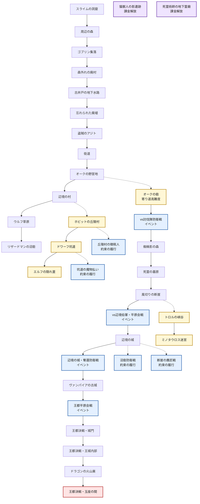

# 遠征エリア解放ルート

## 概要

この図は `src/shared/data/expeditionArea/allArea.json` の `unlockNext` / `unlockNexts` に基づく遠征エリアの解放ルートです。

- 実線: メインの `unlockNext`
- 点線: 寄り道・高難度・イベントなどの追加解放 `unlockNexts`
- `辺境の村` クリア後は、メインの `ウルフ草原` に加えて `ホビットの丘陵村` から始まる寄り道チェーン（丘陵村 → ドワーフ坑道 → エルフの隠れ里）が開きます。
- `オークの野営地・本陣` からは `オークの砦` にも分岐し、ここを制圧すると `vs討伐隊防衛戦` が解放されます。
- `vs討伐隊防衛戦・決戦` の後は、`蜘蛛影の森 -> 死霊の墓原 -> 風切りの断崖` を経て、平原会戦イベント（`vs辺境伯軍・平原会戦`）を制してから `辺境の城` 攻略へ進みます。
- `辺境の城` 制圧後は、奪還防衛戦イベントを挟んで `ヴァンパイアの古城` へ。同時に「約束の履行」サイドイベント（沼砦防衛戦・断崖の鷹匠戦）が開きます。
- `ヴァンパイアの古城` の後は `王都平原会戦` イベントを制してから王都決戦（城門 → 王城内部 → ドラゴン火山巣 → 玉座の間）へ進みます。

## 解放ルート

## イベント型ダンジョン

「場所を攻略する」通常ダンジョンと違い、ストーリー上の会戦・防衛戦をそのまま遊ぶエリア。

| エリア | 種別 | 位置づけ |
| --- | --- | --- |
| vs討伐隊防衛戦 | 本筋イベント | 最初の対人間会戦。ギド戦死の山場 |
| vs辺境伯軍・平原会戦 | 本筋イベント | グレアムの出撃野戦。辺境の城攻略の前哨戦 |
| 辺境の城・奪還防衛戦 | 本筋イベント | 初めて「守る側」に回る防衛戦。騎士ロランが先鋒 |
| 王都平原会戦 | 本筋イベント | 王国全軍との最大会戦。元帥ガリウスが指揮 |
| 沼砦防衛戦 | 約束の履行（サイド） | 「沼を涸らさない」の履行。辺境の城クリアで解放 |
| 断崖の鷹匠戦 | 約束の履行（サイド） | 「空を分け合う」の履行。辺境の城クリアで解放 |
| 丘陵村の徴税人 | 約束の履行（サイド） | 「丘を守る」の履行。丘陵村クリアで解放 |
| 坑道の魔物払い | 約束の履行（サイド） | 「火を絶やさない」の履行。ドワーフ坑道クリアで解放 |

## 現在の寄り道エリア

| 解放元 | 寄り道エリア | 位置づけ |
| --- | --- | --- |
| 辺境の村 | ホビットの丘陵村 → ドワーフ坑道 → エルフの隠れ里 | 種族との約束を積む寄り道チェーン |
| オークの野営地・本陣 | オークの砦 | 討伐隊派遣の直接要因となる分岐ルート |
| 風切りの断崖 | トロルの峡谷 → ミノタウロス迷宮 | 高難度の分岐ルート |
| （課金） | 猫獣人の影遺跡 / 死霊術師の地下霊廟 | サイドストーリー購入で解放 |
