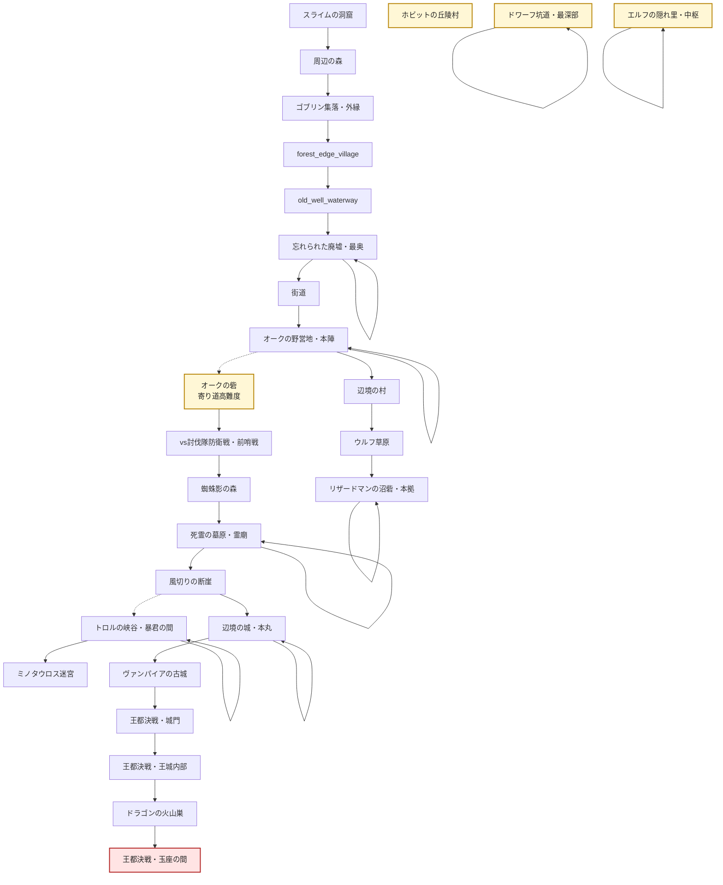

# 遠征エリア解放ルート

## 概要

この図は `src/shared/data/expeditionArea/allArea.json` の `unlockNext` / `unlockNexts` に基づく遠征エリアの解放ルートです。

- 実線: メインの `unlockNext`
- 点線: 寄り道・高難度などの追加解放 `unlockNexts`
- `辺境の村` クリア後は、まず `ウルフ草原` から `リザードマンの沼砦` へ進み、機動力と湿地戦術を獲得します。
- `オークの野営地・本陣` からは `オークの砦` にも分岐し、ここを制圧すると `vs討伐隊防衛戦` が解放されます。
- `vs討伐隊防衛戦・決戦` の後は、`蜘蛛影の森 -> 死霊の墓原 -> 風切りの断崖` を経て、ようやく `辺境の城` 攻略へ進みます。

## 解放ルート

## 現在の寄り道エリア

| 解放元 | 寄り道エリア | 位置づけ |
| --- | --- | --- |
| 解放元なし | ホビットの丘陵村 | いったん宙に置かれた独立寄り道エリア。 |
| 解放元なし | ドワーフ坑道・入口 | いったん宙に置かれた装備強化ルート。 |
| 解放元なし | エルフの隠れ里・外縁 | いったん宙に置かれた独立支線。 |
| オークの野営地・本陣 | オークの砦 | 討伐隊派遣の直接要因となる分岐ルート。 |
| vs討伐隊防衛戦・決戦 | 蜘蛛影の森 | アラクネの協力を得るための次章メインルート。 |
| 死霊の墓原・霊廟 | 風切りの断崖 | 辺境の城攻略前に空の戦力を得る中継ルート。 |
