# 遠征エリア解放ルート

## 概要

この図は `src/shared/data/expeditionArea/allArea.json` の `unlockNext` / `unlockNexts` に基づく遠征エリアの解放ルートです。

- 実線: メインの `unlockNext`
- 点線: 寄り道・高難度などの追加解放 `unlockNexts`
- `オークの砦` は、`オークの野営地・本陣` クリア時に解放される寄り道高難度エリアです。メイン進行の必須ルートではありません。
- `辺境の村・中心部` クリア後は、メインルートの `vs討伐隊防衛戦・前哨戦` と、強化目的の寄り道エリアが同時に解放されます。

## 解放ルート

```mermaid
flowchart TD
  slime_cave["スライムの洞窟"]
  forest_outskirts["周辺の森"]
  goblin_village_1["ゴブリン集落・外縁"]
  goblin_village_2["ゴブリン集落・内部"]
  goblin_village_3["ゴブリン集落・中枢"]
  undead_ruins_1["忘れられた廃墟・入口"]
  undead_ruins_2["忘れられた廃墟・深部"]
  undead_ruins_3["忘れられた廃墟・最奥"]
  road_1["街道"]
  orc_camp_1["オークの野営地・前哨"]
  orc_camp_2["オークの野営地・陣営"]
  orc_camp_3["オークの野営地・本陣"]
  orc_fortress_1["オークの砦<br/>寄り道高難度"]
  subjugation_force_1["vs討伐隊防衛戦・前哨戦"]
  subjugation_force_2["vs討伐隊防衛戦・迎撃"]
  subjugation_force_3["vs討伐隊防衛戦・決戦"]
  human_village["辺境の村"]
  hobbit_hills_1["ホビットの丘陵村"]
  dwarf_mine_1["ドワーフ坑道・入口"]
  dwarf_mine_2["ドワーフ坑道・深層"]
  dwarf_mine_3["ドワーフ坑道・最深部"]
  elf_forest_1["エルフの隠れ里・外縁"]
  elf_forest_2["エルフの隠れ里・内部"]
  elf_forest_3["エルフの隠れ里・中枢"]
  lizardman_swamp_1["リザードマンの沼砦・浅瀬"]
  lizardman_swamp_2["リザードマンの沼砦・深沼"]
  lizardman_swamp_3["リザードマンの沼砦・本拠"]
  harpy_cliff_1["ハーピィの崖巣"]
  troll_canyon_1["トロルの峡谷・入口"]
  troll_canyon_2["トロルの峡谷・深部"]
  troll_canyon_3["トロルの峡谷・暴君の間"]
  minotaur_labyrinth_1["ミノタウロス迷宮"]
  human_fortress_1["人間の城塞・外壁"]
  human_fortress_2["人間の城塞・城内"]
  human_fortress_3["人間の城塞・本丸"]
  vampire_castle_1["ヴァンパイアの古城"]
  royal_capital_1["王都決戦・城門"]
  royal_capital_2["王都決戦・王城内部"]
  dragon_volcano_1["ドラゴンの火山巣"]
  royal_capital_3["王都決戦・玉座の間"]

  slime_cave --> forest_outskirts
  forest_outskirts --> goblin_village_1
  goblin_village_1 --> goblin_village_2
  goblin_village_2 --> goblin_village_3
  goblin_village_3 --> undead_ruins_1
  undead_ruins_1 --> undead_ruins_2
  undead_ruins_2 --> undead_ruins_3
  undead_ruins_3 --> road_1
  road_1 --> orc_camp_1
  orc_camp_1 --> orc_camp_2
  orc_camp_2 --> orc_camp_3
  orc_camp_3 --> human_village
  orc_camp_3 -.-> orc_fortress_1
  human_village --> subjugation_force_1
  human_village -.-> hobbit_hills_1
  human_village -.-> dwarf_mine_1
  human_village -.-> lizardman_swamp_1
  subjugation_force_1 --> subjugation_force_2
  subjugation_force_2 --> subjugation_force_3
  subjugation_force_3 --> human_fortress_1
  dwarf_mine_1 --> dwarf_mine_2
  dwarf_mine_2 --> dwarf_mine_3
  dwarf_mine_3 --> elf_forest_1
  elf_forest_1 --> elf_forest_2
  elf_forest_2 --> elf_forest_3
  elf_forest_3 -.-> lizardman_swamp_1
  lizardman_swamp_1 --> lizardman_swamp_2
  lizardman_swamp_2 --> lizardman_swamp_3
  lizardman_swamp_3 --> harpy_cliff_1
  harpy_cliff_1 --> troll_canyon_1
  troll_canyon_1 --> troll_canyon_2
  troll_canyon_2 --> troll_canyon_3
  troll_canyon_3 --> minotaur_labyrinth_1
  human_fortress_1 --> human_fortress_2
  human_fortress_2 --> human_fortress_3
  human_fortress_3 --> vampire_castle_1
  vampire_castle_1 --> royal_capital_1
  royal_capital_1 --> royal_capital_2
  royal_capital_2 --> dragon_volcano_1
  dragon_volcano_1 --> royal_capital_3

  classDef sideQuest fill:#fff7d6,stroke:#b8860b,stroke-width:2px,color:#222;
  classDef finalArea fill:#ffe4e4,stroke:#b22222,stroke-width:2px,color:#222;
  class orc_fortress_1,hobbit_hills_1,dwarf_mine_1,lizardman_swamp_1 sideQuest;
  class royal_capital_3 finalArea;
```

## 現在の寄り道エリア

| 解放元 | 寄り道エリア | 位置づけ |
| --- | --- | --- |
| オークの野営地・本陣 | オークの砦 | 解放直後はまず勝てない高難度エリア。オーク重装兵と雇われトロルが出現。 |
| 辺境の村・中心部 | ホビットの丘陵村 | 強化・資源目的の寄り道エリア。 |
| 辺境の村・中心部 | ドワーフ坑道・入口 | 装備強化ルートの入口。 |
| 辺境の村・中心部 | リザードマンの沼砦・浅瀬 | 種族多様化ルートの入口。 |
